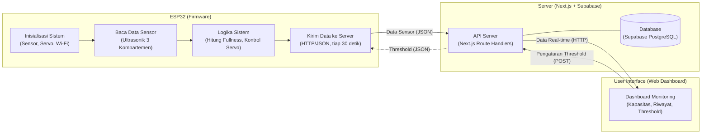

# Software Architecture (Basic IoT)

Alur data: **ESP32 → API Server → Dashboard** (kiri ke kanan).

## Endpoint

| Endpoint | Metode | Dipakai oleh |
| --- | --- | --- |
| `/api/smartbin` | POST | ESP32 (kirim data sensor) |
| `/api/smartbin/now` | GET | Dashboard (data terbaru) |
| `/api/smartbin/average` | GET | Dashboard (riwayat/rata-rata) |
| `/api/smartbin/threshold` | GET / POST | Dashboard (atur), ESP32 (baca) |
